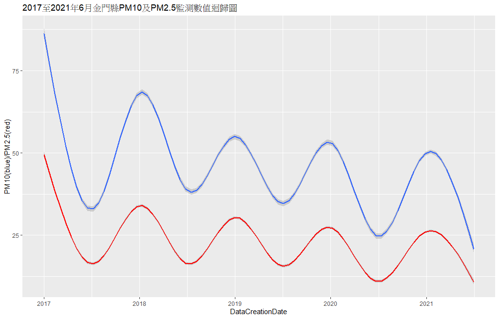
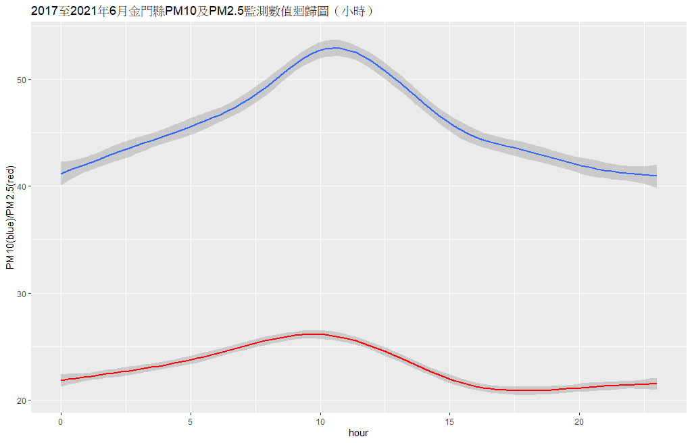
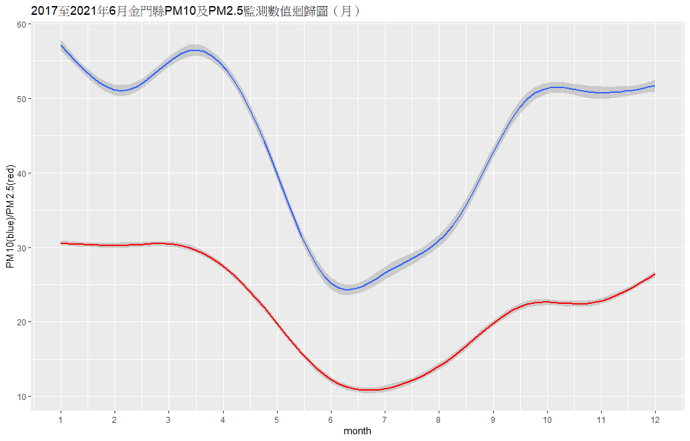
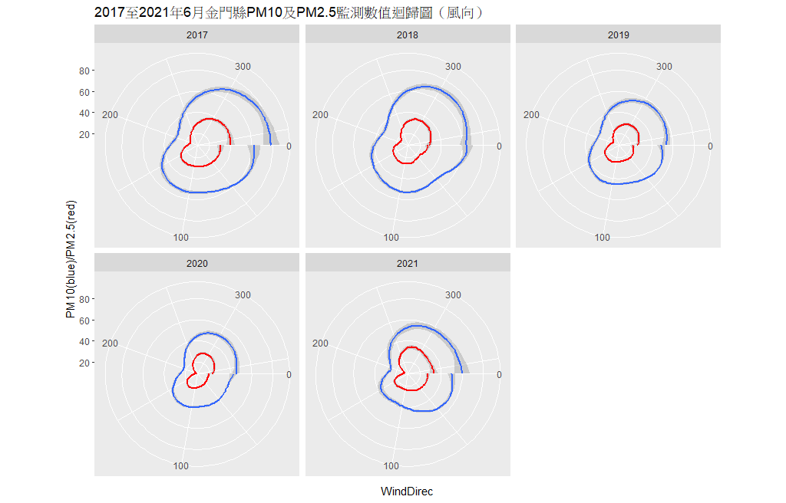
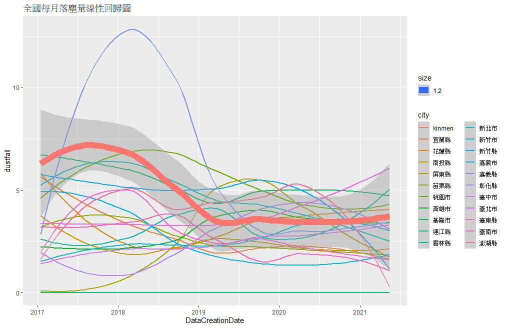
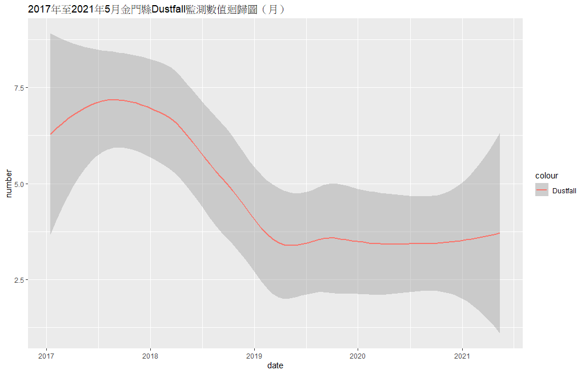
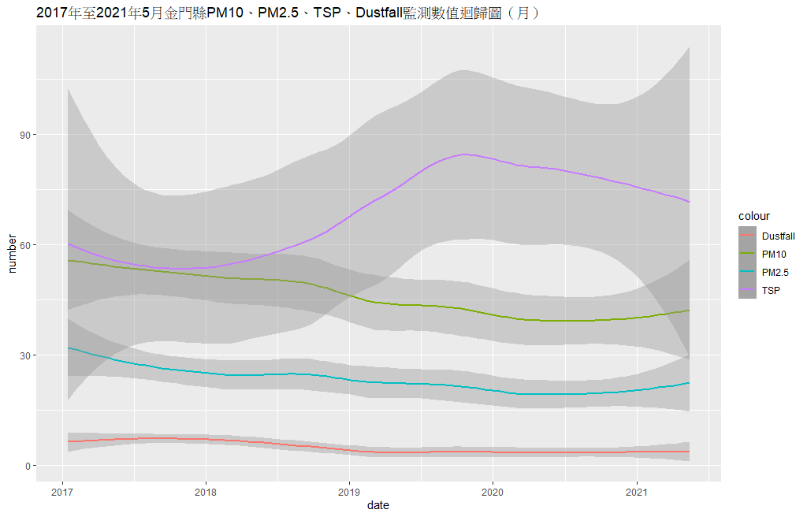
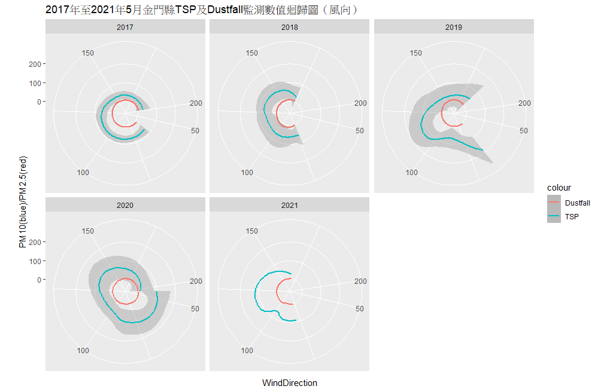

# KinmenAirQuality

大約2021年7月中旬左右，收集了金門縣空氣品質的歷史資料，因此產出了較長時間級距的統計結果；後來在8月，又找到了落塵量的紀錄，因此再加入一併分析。

因為金門縣觀測點少、資料量也少的關係，推論過程會有很多假設無法證明，短期間內我也不太有時間再去研究它們，所以跑完圖後就放著了。

後來是想說都跑完圖了，那就開放出來，也許有人用得上也說不一定。於是今天就放到Github上了。

以下是跑出來的圖：

